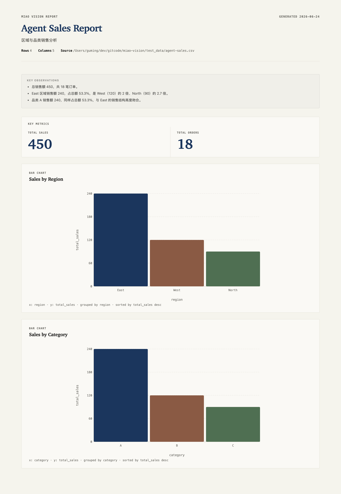
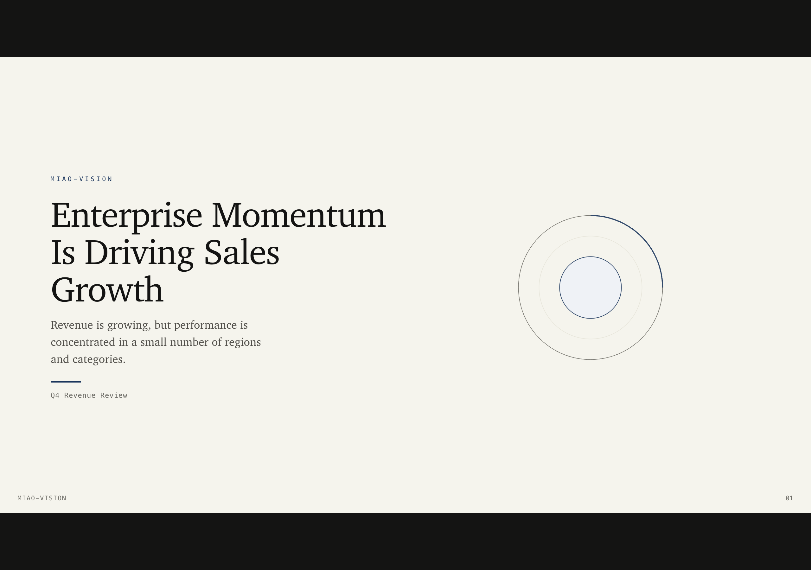

# Miao Vision

> From data file to shareable visual report — one command, or one sentence to your AI agent.

[](https://www.npmjs.com/package/@miao-vision/cli)
[](https://www.typescriptlang.org/)

<table>
<tr>
<td></td>
<td></td>
</tr>
<tr>
<td align="center"><em>Data report — KPI cards, charts, written insights</em></td>
<td align="center"><em>Presentation deck — keyboard navigation, print-to-PDF</em></td>
</tr>
</table>

Give Miao Vision a CSV, spreadsheet, or article. You get a self-contained HTML file — KPI cards, charts, tables, insights — ready to open, share, or email. No server. No login. No expiry.

Built for **analysts and developers** who want a polished output in minutes, not a dashboard to maintain forever.

---

## What you get

**Data report** — KPI cards, bar charts, line trends, tables, and written insights, all in one HTML file.

**Presentation deck** — browser slides with keyboard navigation, fullscreen, and print-to-PDF. No PowerPoint required.

**Article infographic** — paste in an article URL or Markdown file; get back a static visual summary you can drop into any document.

All outputs are a single `.html` file. Open it anywhere, share it with anyone, archive it forever.

---

## Get started

### Option A — Via AI agent (recommended)

Ask your agent (Claude, Codex, or any agent with shell access):

```
Read https://miaoshou.dev/SKILL.md and follow the instructions to install or upgrade miao-viz for your AI agent.
```

The agent installs the CLI and skill in one shot, then you can immediately ask it to analyze your data and generate reports. No manual steps.

Once installed, just describe what you want:

| What you say | What you get |
|---|---|
| "analyze sales.csv and make a report" | Self-contained HTML data report |
| "turn this into a deck for Monday's meeting" | Browser slide deck |
| "make an infographic from this article" | Static infographic HTML |

**Manual install** — install the skill for your agent:

```bash
# Quick install (all agents)
npx skills add miaoshou-dev/miao-vision

# Or from GitHub Releases ZIP
# Download miao-vision-skill.zip from https://github.com/miaoshou-dev/miao-vision/releases
npm install -g @miao-vision/cli
mkdir -p ~/.claude/skills
unzip miao-vision-skill.zip -d ~/.claude/skills/
```

---

### Option B — Manual install

**Step 1 — Install the CLI**

```bash
npm install -g @miao-vision/cli
```

**Step 2 — Run on your data**

```bash
miao-viz profile ./sales.csv
miao-viz render --input ./sales.csv --spec ./report.yaml --output ./report.html
open ./report.html
```

---

## Built for AI agents

Most tools treat AI as an afterthought. Miao Vision is designed from the ground up as a visualization backend that AI agents can drive reliably. Every command returns structured, machine-readable output. The spec format is compact by design — agents write a few dozen lines of YAML, not hundreds of lines of chart code.

### The problem with naive AI visualization

When you ask an AI agent to "make a chart from this CSV", it typically:

- Generates hundreds of lines of HTML + CSS + JavaScript from scratch
- Hallucinates field names it never confirmed exist
- Invents statistics instead of computing them from actual data
- Produces output that looks plausible but is factually wrong

The result wastes tokens, requires manual review, and still fails on complex data.

### How Miao Vision solves this

A four-step pipeline that constrains the agent to what it's good at — reasoning — and delegates everything else to the CLI:

```
1. Analyze    miao-viz analyze   → CLI inspects data, pre-computes summaries and evidence
2. Draft      agent writes spec  → compact YAML citing pre-computed values, not invented ones
3. Validate   miao-viz validate  → CLI checks the spec, returns machine-readable patch hints
4. Render     miao-viz render    → CLI produces a self-contained HTML file
```

The agent never generates chart code. It writes a spec. The CLI renders it.

### Three design guarantees

#### 1. Fewer tokens

The `analyze` command pre-computes everything the agent needs — field roles, grouped aggregates, time periods, ranked results — as a structured JSON briefing. The agent reads the briefing and writes the spec. It doesn't spend tokens exploring the data:

```bash
miao-viz analyze ./sales.csv \
  --intent "monthly trend and top regions" \
  --output /tmp/context.json
```

Output includes `fields[]`, `evidence[]`, `catalog`, and `promptRules[]` — a complete decision package, not raw rows to reason over.

#### 2. More accurate output

Agents cite pre-computed evidence. They don't compute numbers.

Every insight in the spec uses `$evidence:` directives that bind to pre-computed query results at render time:

```yaml
insights:
  - "East contributed $evidence:by_region.rows[0].total — the largest region in this dataset."
```

The CLI resolves every `$evidence:` path during `validate`. If a path doesn't exist, the agent gets `EVIDENCE_PATH_NOT_FOUND` — a hard error — before any HTML is produced. Hallucinated statistics fail fast, not silently.

`validate --verify` adds a second layer: it flags forbidden language (`trend`, `significant`, `strong correlation`) used without statistical backing, and catches missing caveats when sample sizes are small.

#### 3. Machine-readable fixes

When `validate` finds problems, it returns structured `patches[]` the agent can apply directly — no free-form error messages to interpret:

```json
{
  "ok": false,
  "patches": [
    { "op": "replace", "path": "/charts/0/encoding/x/type", "value": "temporal" }
  ]
}
```

The agent applies the patch, re-validates, and renders. No human intervention required.

---

## Why Miao Vision

| | |
|---|---|
| **AI-native pipeline** | Every CLI command returns structured JSON. Agents read briefings, not raw data. Specs are compact YAML — never raw chart code. |
| **Evidence-grounded output** | Insights cite pre-computed evidence via `$evidence:` directives. Every path is validated before rendering. Hallucinated statistics fail fast. |
| **Machine-readable fixes** | `validate --patch-hints` returns `patches[]` the agent applies directly. No retry loops, no free-form error parsing. |
| **Your data stays local** | Nothing leaves your machine. No upload, no API call with your data. |
| **One file to share** | Every output is a self-contained `.html` file — open it, email it, archive it. No viewer needed. |
| **Not a dashboard** | No database to connect, no tiles to arrange, no filter panel to maintain. You get an artifact, not a workspace. |
| **Looks good by default** | The magazine theme is designed to be clear and credible out of the box. |

---

## UseCase

### 1. Data report

You have a CSV, TSV, XLSX, or JSON file. You want a chart report to share with your team.

Ask your AI agent:
```
Use miao-vision to analyze ~/data/sales.csv and generate an HTML report.
```

Or run the CLI yourself:
```bash
miao-viz profile ./sales.csv
miao-viz render --input ./sales.csv --spec ./sales-dashboard.yaml --output ./report.html
```

You get: KPI cards, bar charts, trend lines, and data tables — styled and ready to share.

---

### 2. Presentation deck

You have data and you need slides for a meeting — not a chart dump, but an actual narrative deck.

Ask your AI agent:
```
Use miao-vision to turn ~/data/sales.csv into a presentation deck for an executive review.
```

Or use the CLI:
```bash
miao-viz deck --input ./sales.csv --spec ./sales-deck.yaml --output ./deck.html
```

You get: a browser-based slide deck with cover, metrics, charts, and an ending slide. Arrow-key navigation, fullscreen, and print-to-PDF built in.

---

### 3. Article infographic

You have an article URL or a Markdown file and you want a visual summary — not just a wall of text.

Ask your AI agent:
```
Use miao-vision to turn this article Markdown file into an infographic.
```

Or use the CLI:
```bash
miao-viz article ./my-article.md --style editorial --output ./infographic.html
```

You get: a static, shareable infographic you can embed or send directly.

---

## VizSpec example

If you prefer writing specs yourself, here's what a simple one looks like:

```yaml
title: Sales Dashboard
theme: magazine
charts:
  - type: bigvalue
    title: Total Sales
    data:
      transform:
        - type: aggregate
          measures:
            - field: sales
              op: sum
              as: total_sales
    encoding:
      value:
        field: total_sales

  - type: bar
    title: Sales by Region
    data:
      transform:
        - type: aggregate
          groupBy: [region]
          measures:
            - field: sales
              op: sum
              as: total_sales
        - type: sort
          field: total_sales
          order: desc
    encoding:
      x:
        field: region
      y:
        field: total_sales
```

Run `miao-viz catalog` for the full catalog with encoding rules, anti-patterns, and usage guidance.

---

## Supported chart types

Miao Vision supports 27 chart types across three categories:

### Standard

| Chart | Description |
|-------|-------------|
| `bar` | Vertical bars for ranking and comparison across categories |
| `line` | Connected series for trends and time series |
| `area` | Filled line chart for cumulative trends and stacked mass |
| `pie` | Proportional slices for part-to-whole composition (2-7 categories) |
| `scatter` | Points on two axes for correlation and relationship analysis |
| `histogram` | Binned distribution of a single numeric field |
| `heatmap` | Colored grid for matrix density and cross-tab patterns |
| `table` | Sortable HTML table for detail view |
| `bigvalue` | Large single-number KPI for top-level metrics |

### Extended

| Chart | Description |
|-------|-------------|
| `progress` | Horizontal progress bar for goal attainment |
| `sparkline` | Tiny inline line chart for embedding in tables |
| `delta` | KPI value with up/down arrow and percentage change |
| `funnel` | Narrowing trapezoids for conversion stage dropoff |
| `gauge` | Semi-circular gauge with needle for threshold monitoring |
| `bubble` | Circle points on two axes with radius encoding a third measure |
| `boxplot` | Box-and-whisker for distribution comparison across groups |
| `waterfall` | Floating bar cascade for financial bridges and cumulative breakdown |
| `radar` | Spider-web polygon for multi-faceted performance profiling |
| `calendar` | Day-of-week grid for daily activity density |
| `treemap` | Nested rectangles for part-to-whole with many categories |
| `pivot` | HTML cross-tabulation with row/column dimensions |
| `sankey` | Curved flows between source and target nodes |

### Infographic

| Chart | Description |
|-------|-------------|
| `infographic-kpi` | Stylized KPI card with gradient background |
| `infographic-list` | Ranked item list with numbered badges |
| `infographic-flow` | Sequential step flow with arrow connectors |
| `infographic-hierarchy` | Tree structure with center divider line |
| `infographic-comparison` | Side-by-side comparison cards |

---

## DeckSpec example

```yaml
title: Sales Review
theme: magazine
slides:
  - layout: cover
    eyebrow: Q4 Review
    title: Sales Momentum Is Concentrated In Key Regions
    claim: Revenue is growing, but performance is not evenly distributed.

  - layout: metrics-chart
    eyebrow: Executive Snapshot
    title: Quarter At A Glance
    metrics:
      - label: Total Revenue
        format: "$,.0f"
        data:
          transform:
            - type: aggregate
              measures:
                - field: sales
                  op: sum
                  as: total_sales
    charts:
      - type: line
        title: Monthly Sales Trend
        data:
          transform:
            - type: derive-month
              field: order_date
              as: month
            - type: aggregate
              groupBy: [month]
              measures:
                - field: sales
                  op: sum
                  as: total_sales
            - type: sort
              field: month
              order: asc
        encoding:
          x:
            field: month
          y:
            field: total_sales
```

Supported layouts: `cover`, `title-only`, `text-points`, `text-chart`, `metrics-chart`, `chart-full`, `table-full`, `ending`.

---

## CLI reference

Commands are organized into three groups:

### data — Inspect and query data files

| Command | What it does |
|---|---|
| `miao-viz data profile <file>` | Inspect fields, types, and distributions |
| `miao-viz data query <file>` | Run ad-hoc aggregation queries |
| `miao-viz data analyze <file>` | Pre-compute evidence pack and catalog for agent consumption |

### spec — Author, validate, and debug specs

| Command | What it does |
|---|---|
| `miao-viz spec validate` | Check your VizSpec or DeckSpec; return machine-readable patch hints |
| `miao-viz spec catalog` | List chart types and infographic templates |
| `miao-viz spec block` | Instantiate report blocks from analyze context |
| `miao-viz spec template` | List, inspect, or instantiate report templates |
| `miao-viz spec inspect` | Debug chart transform pipelines and evidence usage |

### render — Generate HTML output

| Command | What it does |
|---|---|
| `miao-viz render report` | Render a vizspec to self-contained HTML or SVG |
| `miao-viz render deck` | Render a deck spec to HTML slides |
| `miao-viz render article` | Convert a local Markdown/text file into a static infographic |

Legacy flat commands (`profile`, `render`, `deck`, ...) still work for backward compatibility.

---

## Documentation

- [Product Overview](./docs/PRODUCT_OVERVIEW.md)
- [Agent Install Guide](./docs/miao-vision-agent-install.md)
- [Feature Roadmap](./docs/roadmap/FEATURE_ROADMAP.md)
- [All docs](./docs/README.md)

---

## Development

```bash
npm run dev          # Start the Svelte preview app (http://localhost:5173)
npm run build:cli    # Build the miao-viz CLI package
npm run check        # TypeScript and Svelte diagnostics
npm run test         # Run unit tests
```

The web app is a preview and debugging surface. The main product path is the CLI, optionally driven by an agent skill.

---

## License

MIT
