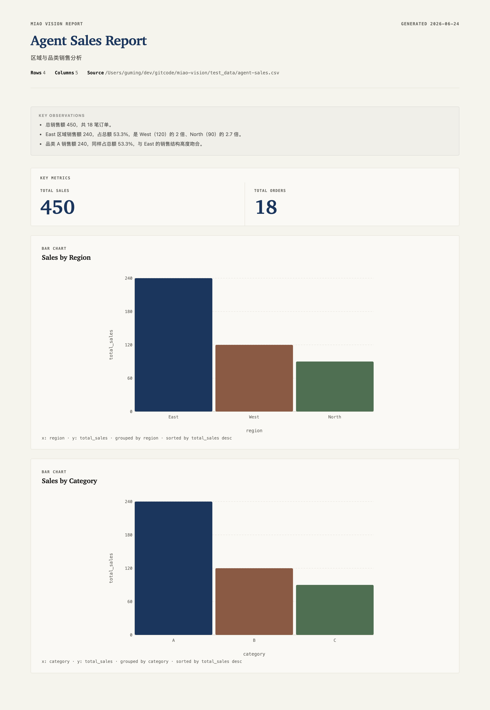
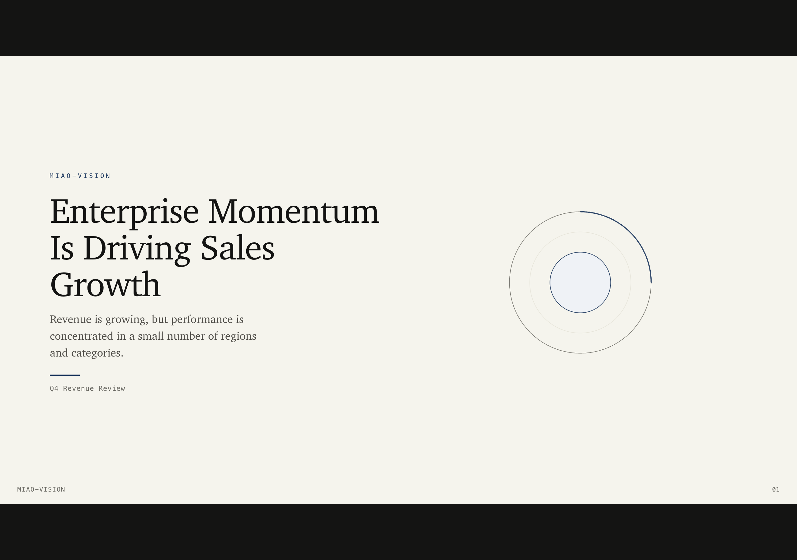

# Miao Vision

> Turn local data or documents into evidence-backed reports, posters, decks, and article infographics.

[](https://www.npmjs.com/package/@miao-vision/cli)
[](https://www.typescriptlang.org/)

<table>
<tr>
<td></td>
<td></td>
</tr>
<tr>
<td align="center"><em>Data report: KPIs, charts, evidence, and insights</em></td>
<td align="center"><em>Presentation deck: narrative slides, keyboard navigation, PDF export</em></td>
</tr>
</table>

Miao Vision is an AI-first, local-first visualization system. Its primary engine is the `miao-viz` CLI: it profiles local files, computes reusable evidence, validates compact specs, and produces self-contained artifacts that are easy to review and share.

Source data stays on your machine during the standard report, poster, deck, article, and validation workflows. There is no required backend, account, or API key.

## What it creates

| Artifact | Best for | Output |
|---|---|---|
| **Data report** | KPI summaries, trends, comparisons, detail tables, and evidence-backed findings | HTML, SVG, PNG, PDF |
| **Data poster** | One-page rankings, comparisons, composition, flows, timelines, and geographic summaries | HTML, PNG, single-page PDF |
| **Recurring report** | Replaying verified metrics, evidence recipes, layout, and theme on a new period | Versioned HTML/PDF runs with review state |
| **Presentation deck** | Executive reviews, proposals, explainers, project updates, and hybrid data narratives | Browser deck or 16:9 PDF |
| **Article infographic** | Visual summaries of normalized local Markdown or text | HTML, PNG, PDF, JSON, Markdown |

Generated HTML is self-contained. Interactive reports can include safe local filters and detail views; trusted delivery validates an explicit data-exposure policy before writing the artifact.

## Get started

### Install the cross-host plugin

Download [`miao-vision-plugin.zip`](https://github.com/miaoshou-dev/miao-vision/releases/latest/download/miao-vision-plugin.zip) from the [latest GitHub Release](https://github.com/miaoshou-dev/miao-vision/releases/latest).

| Host | Installation |
|---|---|
| Codex | Install `miao-vision-plugin.zip` through the Codex plugin surface |
| Claude Code | Add `miaoshou-dev/miao-vision` as a marketplace, then install `miao-vision@miao-vision` |
| OpenClaw | Run `openclaw plugins install ./miao-vision-plugin.zip`, then enable `miao-vision` |

The plugin looks for a compatible CLI in this order:

1. `$MIAO_VISION_HOME/bin/miao-viz`
2. `~/.miao-vision/bin/miao-viz`
3. `miao-viz` on `PATH`

If none is compatible, the plugin asks before downloading the matching checksum-verified CLI release. Browser dependencies for PNG/PDF export are optional and are not bundled with the plugin.

Once installed, describe the outcome you want:

```text
Analyze sales.xlsx and make an executive report with a printable PDF.
Turn this campaign export into a one-page comparison poster.
Use this Markdown brief and the attached CSV to make a presentation deck.
Update last week's verified report with this week's file.
```

For a Skill-only compatibility install:

```bash
npx skills add miaoshou-dev/miao-vision -g -a codex -y
# or
npx skills add miaoshou-dev/miao-vision -g -a claude-code -y
```

### Install only the CLI

```bash
npm install -g @miao-vision/cli
miao-viz data profile ./sales.csv --summary
```

Node.js 20 or newer is required.

## Core workflows

### Direct, evidence-grounded generation

Use this path when the desired artifact is already clear:

```text
analyze → instantiate or author spec → validate → render → deliver
```

```bash
# 1. Compute fields, metric candidates, evidence, warnings, and allowed charts.
miao-viz data analyze ./sales.csv \
  --intent "monthly trend and top regions" \
  --output /tmp/miao-vision/context.json

# 2. Start from deterministic CLI knowledge when possible.
miao-viz spec scene list
miao-viz spec scene instantiate <scene-id> \
  --context /tmp/miao-vision/context.json \
  --output /tmp/miao-vision/report.yaml

# 3. Validate schema, evidence paths, claim checks, and catalog rules.
miao-viz data profile ./sales.csv > /tmp/miao-vision/profile.json
miao-viz spec validate \
  --spec /tmp/miao-vision/report.yaml \
  --profile /tmp/miao-vision/profile.json \
  --context /tmp/miao-vision/context.json \
  --verify --strict --patch-hints

# 4. Render shareable formats together.
miao-viz render report \
  --input ./sales.csv \
  --spec /tmp/miao-vision/report.yaml \
  --context /tmp/miao-vision/context.json \
  --format html,pdf \
  --output-dir ./output
```

Reports bind displayed values and claims to computed evidence through `$evidence:` directives. Validation returns structured errors and JSON Patch hints, rather than requiring an agent to interpret prose-only failures.

### Plan-first generation

Use the Artifact Plan workflow when the audience, delivery format, scope, or desired outcome is materially ambiguous:

```text
outcome brief → artifact plan → confirm if needed → instantiate → validate → render
```

```bash
miao-viz artifact plan \
  --brief ./outcome-brief.json \
  --context /tmp/miao-vision/context.json \
  --output /tmp/miao-vision/plan.json

miao-viz artifact instantiate \
  --plan /tmp/miao-vision/plan.json \
  --context /tmp/miao-vision/context.json \
  --output /tmp/miao-vision/report.yaml

miao-viz artifact validate \
  --plan /tmp/miao-vision/plan.json \
  --context /tmp/miao-vision/context.json \
  --input ./sales.csv \
  --spec /tmp/miao-vision/report.yaml \
  --output /tmp/miao-vision/verification.json
```

Outcome Memory is explicit and project-local. The CLI never searches for it implicitly; use `miao-viz artifact memory` to inspect, update, or forget confirmed preferences.

## Inspect and query local data

Supported tabular formats are CSV, TSV, XLSX, and JSON.

```bash
miao-viz data profile ./sales.csv
miao-viz data query ./sales.csv \
  --groupby region \
  --measure "sum(sales) as total, count(*) as count" \
  --filter "year>=2025" \
  --orderby "total desc"
miao-viz data analyze ./sales.csv \
  --intent "monthly trend and top regions" \
  --compact
```

- `profile` returns field types, roles, statistics, distributions, correlations, and quality warnings.
- `query` performs deterministic aggregations with filters, grouping, sorting, and limits.
- `analyze` produces the evidence pack, metric candidates, chart catalog, blocked-chart reasons, assumptions, and prompt rules used by downstream workflows.

## Reports, posters, and interaction

Use `spec scene`, `spec template`, or `spec block` before hand-authoring a report. They compile deterministic CLI knowledge into ordinary specs that remain inspectable and editable.

```bash
miao-viz spec scene list
miao-viz spec template list
miao-viz spec block instantiate <block-id> --context ./context.json
```

Poster templates are exposed through the report template catalog. A poster is a validated report spec with `layout.preset: poster`, rendered through the same report command:

```bash
miao-viz spec template instantiate data-poster-ranking \
  --context ./context.json \
  --output ./poster.yaml
miao-viz render report \
  --input ./sales.csv --spec ./poster.yaml --context ./context.json \
  --format html,png,pdf --output-dir ./poster-output
```

For shareable interactive HTML, instantiate only a recommended interaction preset from the analyze context:

```bash
miao-viz spec interaction instantiate filter-and-detail \
  --context ./context.json \
  --output ./interactions.yaml
```

Use `--trusted` with strict verification when third-party delivery must fail closed unless the artifact is share-safe.

## Presentation decks

Decks can be data-driven, document-driven, or hybrid. Markdown/text is analyzed into a `DeckContext`; `--data` adds structured evidence for hybrid decks.

```bash
miao-viz deck analyze ./brief.md \
  --data ./sales.csv \
  --intent "executive business review" \
  --output ./deck-context.json

miao-viz deck instantiate business-review \
  --context ./deck-context.json \
  --output ./deck.yaml

miao-viz deck validate \
  --spec ./deck.yaml --context ./deck-context.json --verify --strict

miao-viz render deck \
  --input ./sales.csv --spec ./deck.yaml --context ./deck-context.json \
  --output ./deck.html
```

Available deterministic intents include `executive-brief`, `business-review`, `topic-explainer`, `project-update`, and `proposal`. Narrative decks without structured data do not require `--input`.

## Article infographics

The CLI accepts local Markdown or text. When the source is a URL, an agent should fetch and normalize it first; the article command intentionally does not fetch remote pages.

```bash
miao-viz render article analyze ./article.md --output ./article-context.json
miao-viz render article catalog --for-llm
miao-viz render article ./article.md \
  --style editorial --format html --output ./infographic.html
```

For controlled compositions, render a complete `InfographicSpec` with `--spec-input`, or an atomic multi-chart bundle with `--bundle-input`.

## Recurring reports

Once a report and its evidence are verified, save the contract and replay it against a new period without redesigning the artifact:

```bash
miao-viz report init ./sales-weekly \
  --input ./week-28.xlsx \
  --spec ./report.yaml \
  --context ./context.json \
  --period 2026-W28 \
  --dry-run

miao-viz report update ./sales-weekly \
  --input ./week-29.xlsx \
  --period 2026-W29 \
  --format html,pdf
```

Projects retain immutable run history, stable evidence IDs and spec hashes, data-contract checks, period outcome briefs, review state, previews, and delivery manifests. Use `report info` and `report history` to inspect them. `report clean` previews removals and requires explicit confirmation.

## Review Viewer and delivery

Render commands return a structured delivery manifest containing status, primary artifact, optional PNG preview, verification coverage, metrics, highlights, warnings, and suggested actions. Agents can deliver from this manifest without scraping the generated HTML.

The optional local Review Viewer shows workflow stages, previews, evidence, data quality, version changes, and exports:

```bash
miao-viz review serve --artifact-root ./output

miao-viz render report \
  --input ./sales.csv --spec ./report.yaml --context ./context.json \
  --output ./output/report.html \
  --review-url http://127.0.0.1:43179 \
  --review-run-id sales-review
```

`miao-viz review mcp` starts the Viewer together with its local stdio MCP integration.

## CLI reference

| Group | Commands | Purpose |
|---|---|---|
| `artifact` | `plan`, `instantiate`, `validate`, `memory` | Plan and verify the intended visual outcome |
| `data` | `profile`, `query`, `analyze` | Inspect files and compute evidence |
| `spec` | `validate`, `catalog`, `block`, `template`, `scene`, `summary`, `diff`, `inspect`, `interaction` | Author, validate, and debug report specs |
| `deck` | `analyze`, `instantiate`, `validate` | Build and verify narrative, data, or hybrid decks |
| `report` | `init`, `update`, `info`, `history`, `clean` | Manage recurring report projects |
| `render` | `report`, `deck`, `article` | Generate HTML, SVG, PNG, or PDF artifacts |
| `review` | `serve`, `mcp` | Run the local review and export surface |

Run `miao-viz --help`, `miao-viz <group> --help`, or `miao-viz <group> <command> --help` for the current contract.

The chart catalog is code-owned and evolves independently of this README. Use the following command for the authoritative chart types, variants, encoding requirements, templates, and anti-patterns:

```bash
miao-viz spec catalog --for-llm
```

## Design guarantees

- **Evidence-grounded:** displayed claims and metrics can be traced to deterministic local computations.
- **Machine-readable:** commands return structured `ok/value` results or structured errors and repair hints.
- **Local-first:** standard workflows do not upload source data or require a backend.
- **Shareable:** artifacts are self-contained, printable, and accompanied by an explicit delivery state.
- **Agent-efficient:** catalog, scene, template, validation, and rendering knowledge lives in the CLI rather than being regenerated as chart code.

Optional AI-generated story images and single-shot videos use a separately configured media workflow, Node.js 22+, `ai-cli`, an AI Gateway key, and separately billed models. The agent must show the model tier, price summary, and upload scope before asking for confirmation. These services are not required for the core visualization workflows.

## Documentation

- [Getting Started](./docs/getting-started/GETTING_STARTED.md)
- [Product Overview](./docs/PRODUCT_OVERVIEW.md)
- [Architecture Overview](./docs/architecture/ARCHITECTURE_OVERVIEW.md)
- [Agent Install Guide](./docs/miao-vision-agent-install.md)
- [Outcome Memory](./docs/outcome-memory.md)
- [Review Viewer](./docs/miao-viz-review-viewer-prd.md)
- [Trusted Interactive Reports](./docs/trusted-interactive-report-prd.md)
- [Feature Roadmap](./docs/roadmap/FEATURE_ROADMAP.md)
- [All documentation](./docs/README.md)

## Development

```bash
npm run dev          # Start the lightweight web preview/distribution app
npm run build:cli    # Bundle packages/miao-viz-cli
npm run test:run     # Run Vitest once
npm run check        # Run Svelte and TypeScript diagnostics
npm run check:size   # Enforce source file size limits
npm run test:e2e     # Run browser/deck end-to-end tests
```

The primary implementation lives in `packages/miao-viz-cli`. The Svelte app is a lightweight landing, preview, packaging, and distribution surface; it does not own report, deck, poster, or article generation logic.

## License

MIT
