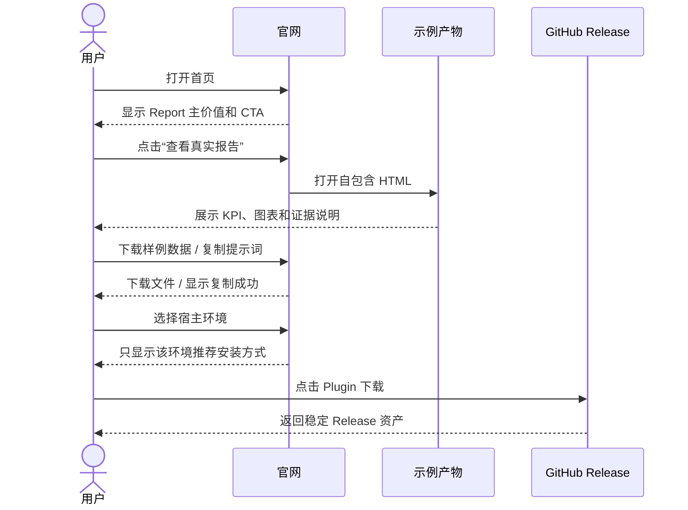
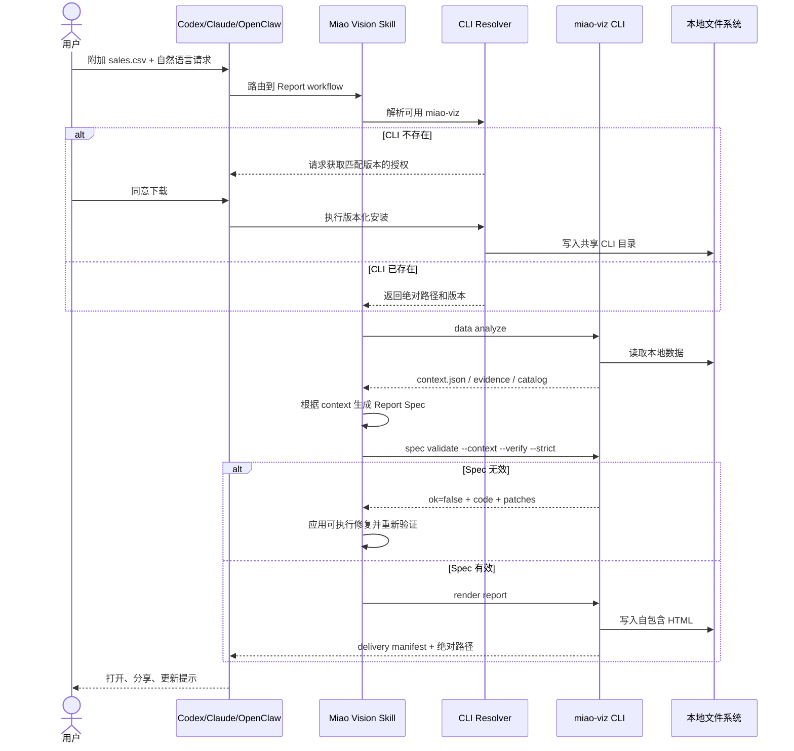
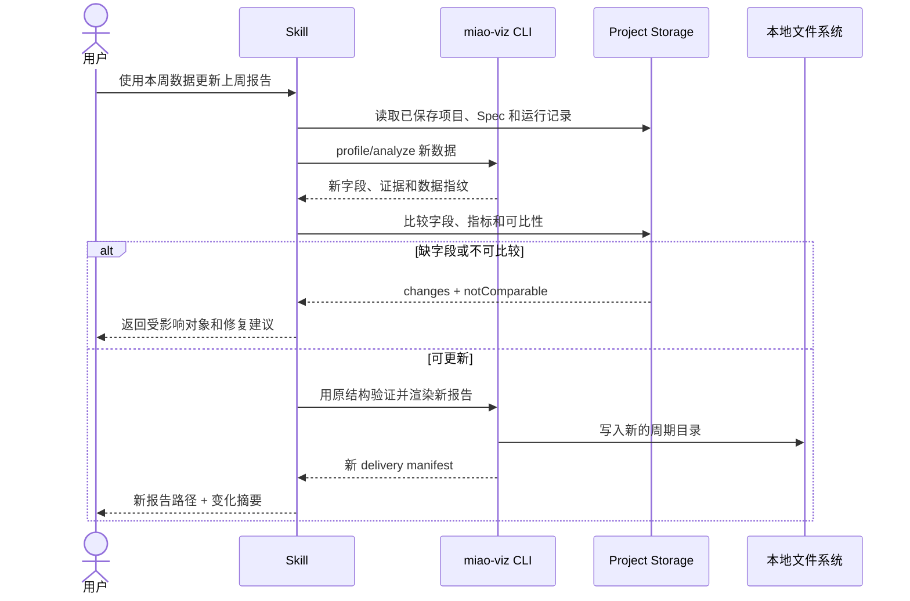
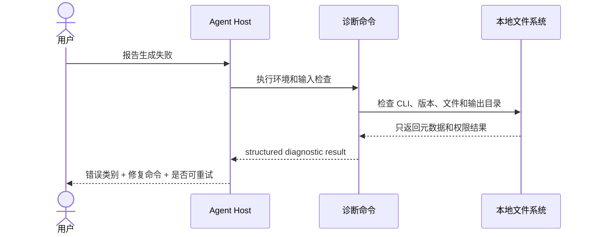

# Miao Vision 增长与首次使用优化设计

## 1. 设计目标

本设计实现 `requirements.md` 中的增长目标：让用户从官网理解产品、选择正确安装方式、在五分钟内生成第一份可信报告，并在后续周期复用报告结构。

设计遵循现有产品边界：Web 只负责分发、预览和引导；本地 CLI 负责数据分析、证据生成、Spec 验证和渲染；Skill 负责把自然语言请求路由到 CLI 工作流。不引入必需的后端、账号、数据上传或在线分析服务。

## 2. 总体架构

```text
┌─────────────────────────────────────────────────────────────┐
│ Public Web: apps/web                                       │
│ Landing → Example Gallery → Install Router → Prompt Guide  │
│                 │ anonymous, non-sensitive events           │
└─────────────────┼───────────────────────────────────────────┘
                  │ links / copy / download
                  ▼
┌─────────────────────────────────────────────────────────────┐
│ Host Adapter Layer                                          │
│ Codex Plugin │ Claude Plugin │ OpenClaw Plugin │ CLI/npm    │
└─────────────────┼───────────────────────────────────────────┘
                  │ local shell execution
                  ▼
┌─────────────────────────────────────────────────────────────┐
│ Miao Vision Skill                                           │
│ intent routing · workflow instructions · CLI resolution     │
└─────────────────┼───────────────────────────────────────────┘
                  ▼
┌─────────────────────────────────────────────────────────────┐
│ miao-viz CLI: packages/miao-viz-cli                         │
│ loader → profile/analyze → spec → validate → render/export  │
│                  │ local files only                         │
│                  ▼                                           │
│ HTML/PDF artifact + evidence + delivery manifest            │
└─────────────────────────────────────────────────────────────┘
```

### 2.1 组件职责

| 组件 | 位置 | 职责 | 不负责 |
|---|---|---|---|
| Landing UI | `apps/web/src/components/LandingPage.svelte` | 首屏定位、主 CTA、产物展示、工作流解释 | 数据读取、报告生成 |
| Install UI | `apps/web/src/components/InstallSection.svelte` | 宿主选择、安装命令、版本和权限说明 | 判断用户本机环境 |
| Example Package | `apps/web/public/examples/` 及样例数据目录 | 提供可打开产物、样例数据和提示词 | 运行用户数据 |
| Skill | `skills/miao-vision/` | Agent 触发边界、CLI 解析、Report/Deck/Article 工作流 | 直接渲染图表 |
| CLI Resolver | `skills/miao-vision/scripts/check-miao-viz.mjs` | 选择可用 CLI、报告版本兼容性 | 安装未经用户授权的软件 |
| Data Pipeline | `packages/miao-viz-cli/src/data-*`、`analyzer.ts` | 本地加载、profiling、query、evidence context | 远程数据访问 |
| Spec Pipeline | `spec-schema.ts`、`spec-validator.ts`、`directive-resolver.ts` | 生成和严格验证 VizSpec、证据路径、patch hints | 绕过验证发布 |
| Report Renderer | `svg-renderer.ts`、`html-export.ts`、`report-delivery.ts` | 生成自包含 HTML/PDF 和交付信息 | 上传产物 |
| Recurring Workflow | `report-project-storage.ts`、`report-changes.ts`、`period-outcome-*` | 保存项目结构、检测字段变化、标记不可比较结果 | 修改上一份产物 |
| Release Pipeline | `.github/workflows/publish-cli.yml`、`publish-skill.yml` | 构建、校验、发布 CLI、Plugin 和 Skill 资产 | 在运行时强制联网 |

### 2.2 关键架构决策

1. **首个激活路径以 Report 为中心。** Deck 和 Infographic 仍然可访问，但不增加新的首屏执行引擎。
2. **版本信息单一来源。** 以 `packages/miao-viz-cli/package.json` 和 `skills/miao-vision/cli-compatibility.json` 的发布校验为基础，Web 文案尽量从构建时注入，而不是手工维护多个版本字符串。
3. **核心路径保持离线。** 官网事件采集失败不得阻断示例浏览、CLI 使用或报告生成。
4. **失败优先返回机器可修复信息。** 所有 CLI 新增失败场景沿用 `{ ok: false, code, message, ... }`，并尽量提供 `details` 和 `patches`。
5. **更新采用写入新产物。** 周期性更新使用临时目录和原子写入，旧产物只读保留。

## 3. 官网信息架构

```text
首屏
├── CSV/Excel → 可分享业务报告
├── 主 CTA：生成第一份报告
├── 次 CTA：查看真实报告
└── 本地、无账号、无需上传
    ↓
真实 Report 示例
├── 打开报告
├── 下载样例数据
├── 复制提示词
└── 选择宿主并安装
    ↓
安装分流
├── Codex：Plugin
├── Claude Code：Plugin
├── OpenClaw：Plugin
└── 纯 CLI：npm CLI
    ↓
首次生成
└── Analyze → Spec → Validate → Render → HTML
    ↓
后续动作
├── 打开/分享报告
├── 使用新数据更新
└── 查看证据说明
```

### 3.1 Web 组件设计

新增或调整以下逻辑组件，仍保持在 Web 分发层：

- `ProductHero`：只呈现 Report 主价值和两个 CTA。
- `ExampleCard`：统一展示产物预览、打开、下载样例数据和复制提示词。
- `InstallRouter`：根据用户选择渲染一个推荐安装路径。
- `PromptCopyBlock`：复制提示词，失败时保留可选择文本。
- `TrustPanel`：解释本地处理、离线 HTML 和证据说明。
- `ActivationNextStep`：展示“打开、分享、更新”三个后续动作。

如果现有 Svelte 文件接近 500 行，应按上述职责拆分；不得把 CLI 运行逻辑导入浏览器代码。

## 4. 主要交互时序

### 4.1 访客浏览示例并进入安装



### 4.2 Plugin 用户首次生成 Report



### 4.3 周期性更新



### 4.4 错误诊断



## 5. 数据模型与接口

### 5.1 官网内容模型

```ts
type HostId = 'codex' | 'claude-code' | 'openclaw' | 'cli'

interface ExamplePackage {
  id: string
  title: string
  artifactUrl: string
  sampleDataUrl?: string
  prompt: string
  artifactKind: 'report' | 'deck' | 'infographic'
  features: string[]
  cliVersion: string
  offline: boolean
  evidencePanel: boolean
}

interface InstallOption {
  host: HostId
  recommended: boolean
  title: string
  description: string
  commands: string[]
  downloadUrl?: string
  verifyCommand: string
  requiresAgent: boolean
  requiresApproval: boolean
}
```

`ExamplePackage.cliVersion` 和 `InstallOption` 中的版本信息由发布构建校验；浏览器端不得根据用户文件推断或修改这些值。

### 5.2 安装诊断模型

```ts
type DiagnosticCode =
  | 'CLI_NOT_FOUND'
  | 'CLI_VERSION_INCOMPATIBLE'
  | 'NODE_VERSION_UNSUPPORTED'
  | 'HOST_PLUGIN_UNAVAILABLE'
  | 'FILE_NOT_FOUND'
  | 'FILE_PERMISSION_DENIED'
  | 'OUTPUT_NOT_WRITABLE'
  | 'PDF_DEPENDENCY_MISSING'

interface DiagnosticResult {
  ok: boolean
  code?: DiagnosticCode
  executable?: string
  cliVersion?: string
  requiredCliVersion?: string
  nodeVersion?: string
  host?: HostId | 'unknown'
  input?: { path: string; format?: string; readable: boolean }
  nextActions: Array<{
    label: string
    command?: string
    safeToRetry: boolean
  }>
}
```

诊断接口只能返回文件元数据和错误类别。`input.path` 在展示层可被脱敏；不得返回文件内容、前若干行、令牌或环境变量值。

### 5.3 CLI 结果契约

继续使用现有结果风格：

```ts
interface AgentSuccess<T> {
  ok: true
  value: T
}

interface AgentFailure {
  ok: false
  code: string
  message: string
  details?: Record<string, unknown>
  patches?: Array<{
    op: 'add' | 'remove' | 'replace'
    path: string
    value?: unknown
  }>
  retryable?: boolean
}

type AgentResult<T> = AgentSuccess<T> | AgentFailure
```

新增或调整的命令输出必须保持 JSON 可解析、稳定字段名和非零退出码的一致性。成功的 Report 交付结果至少包含：

```ts
interface DeliveryManifest {
  primary: { path: string; format: 'html' | 'pdf' }
  preview?: { path: string; format: 'png' | 'html' }
  title: string
  verified: boolean
  shareSafe: boolean
  summary: {
    metrics: Array<{ label: string; value: string }>
    highlights: string[]
    actions: string[]
  }
  warnings: string[]
}
```

### 5.4 周期性项目模型

```ts
interface ReportProject {
  id: string
  title: string
  createdAt: string
  sourceFormat: 'csv' | 'tsv' | 'xlsx' | 'json'
  specPath: string
  metricRecipes: string[]
  evidenceRecipes: string[]
  layoutId: string
  themeId: string
  fieldMap?: Record<string, string>
  latestRun?: { period: string; artifactPath: string; dataFingerprint: string }
}

interface PeriodChanges {
  comparable: string[]
  notComparable: Array<{
    id: string
    reason: string
    affectedObjects: string[]
  }>
  addedFields: string[]
  removedFields: string[]
  changedFields: string[]
}
```

项目文件只保存配置、Spec、字段映射和数据指纹，不复制原始数据；路径必须限定在用户选择的项目或任务目录内。

### 5.5 匿名漏斗事件

```ts
type FunnelEventName =
  | 'landing_view'
  | 'example_open'
  | 'install_click'
  | 'install_verify'
  | 'first_report_start'
  | 'first_report_success'
  | 'first_report_failure'
  | 'repeat_report_start'

interface FunnelEvent {
  name: FunnelEventName
  eventId: string
  occurredAt: string
  source: 'web' | 'github' | 'npm' | 'community' | 'unknown'
  host: HostId | 'unknown'
  installMethod: 'plugin' | 'npm' | 'skill' | 'unknown'
  cliVersion?: string
  errorCode?: string
  durationMs?: number
  schemaVersion: 1
}
```

默认事件在 Web 端只记录页面动作，不采集文件名、文件内容、路径或用户标识；CLI 端默认本地输出诊断信息。若未来增加远程汇总，必须是可选开关且不影响核心流程。

## 6. 技术栈建议

### 6.1 继续使用的技术

| 层 | 技术 | 原因 |
|---|---|---|
| Web | Svelte 5 + Vite + TypeScript | 与现有 `apps/web` 一致，适合静态分发页 |
| CLI | Node.js 20+ + TypeScript | 与 `@miao-vision/cli` 当前 engines 和构建链一致 |
| 数据读取 | 现有 CSV/TSV/JSON/XLSX loader | 支持本地文件且无需新增服务 |
| Spec | YAML + Zod | 已有 VizSpec schema 和结构化校验体系 |
| 图表 | 现有纯 SVG renderer | 离线、自包含、便于 PDF/HTML 复用 |
| 测试 | Vitest、Svelte check、Playwright | 已存在且覆盖 CLI、Web 和端到端路径 |
| 发布 | npm + GitHub Release + GitHub Actions | 已有 CLI、Plugin、Skill 发布工作流 |

### 6.2 推荐新增能力

- 用构建脚本生成 `install-manifest.json`，从版本兼容性配置生成官网安装数据。
- 用一个轻量的 `diagnose` CLI 子命令或现有检查脚本扩展实现环境诊断。
- 用本地 JSONL 或标准输出保存可选的 CLI 漏斗事件；默认不联网。
- 使用 `crypto` 的 SHA-256 数据指纹识别周期变化，不保存原始数据。
- 使用临时目录 + `rename` 实现 HTML/PDF 产物原子交付。
- 使用 GitHub Release 的固定资产命名和 checksum 文件，不引入自建下载服务。

### 6.3 明确不采用

- 不采用 SaaS 后端作为首次激活依赖。
- 不采用账号、数据库或远程埋点作为核心指标前提。
- 不采用新的前端状态管理库；本需求不需要跨页面业务状态。
- 不把数据分析逻辑复制到 Svelte 浏览器端。
- 不同时维护 Plugin 私有 CLI 和共享 CLI 两套运行时。

## 7. 错误处理设计

### 7.1 分层错误策略

```text
输入/环境错误 → 预检阶段阻断
分析错误       → 返回字段、格式和数据质量详情
Spec 错误      → 返回对象路径、错误码和 patch hints
渲染错误       → 保留中间结果，返回可重试阶段
交付错误       → 不覆盖旧产物，返回实际输出位置
指标错误       → 静默降级，不阻断用户工作流
```

### 7.2 错误分类

| 类别 | 示例 | 处理方式 | 是否可重试 |
|---|---|---|---|
| 环境 | CLI 缺失、Node 版本过低 | 返回诊断和安装/升级命令 | 修复后可重试 |
| 输入 | 文件不存在、格式损坏、权限拒绝 | 在 Analyze 前阻断，指出具体路径和格式 | 修复输入后可重试 |
| 语义 | 找不到字段、没有时间维度 | 返回字段候选和降级建议 | 修改请求或字段后可重试 |
| 验证 | 证据路径无效、声明值不匹配、图表被阻止 | 阻止严格发布，返回 patch hints | 修复 Spec 后可重试 |
| 导出 | Playwright/PDF 依赖缺失 | HTML 正常交付，PDF 单独失败 | 安装依赖后可重试 |
| 文件系统 | 输出目录不可写、磁盘写入中断 | 使用任务级临时目录或停止，旧文件不动 | 修复目录后可重试 |
| 网络 | Release 下载不可达 | 不伪造成功，提供 npm/手动 ZIP 备用路径 | 网络恢复后可重试 |
| 分析质量 | 样本过小、字段缺失、不可比较 | 保留警告，降低结论强度 | 视数据情况决定 |
| 观测 | 事件发送失败 | 丢弃或本地保留，不影响主流程 | 否 |

### 7.3 用户可见错误格式

Agent 回复和诊断输出统一包含：

1. 发生了什么。
2. 影响了哪个阶段或对象。
3. 下一步可以执行什么。
4. 是否可以安全重试。
5. 是否已有可用产物。

示例：

```json
{
  "ok": false,
  "code": "FIELD_NOT_FOUND",
  "message": "Report spec references field 'revenue_total', but the input profile has no such field.",
  "details": {
    "field": "revenue_total",
    "availableFields": ["date", "region", "sales"]
  },
  "patches": [
    { "op": "replace", "path": "/charts/0/encoding/value/field", "value": "sales" }
  ],
  "retryable": true
}
```

## 8. 测试策略

### 8.1 单元测试

覆盖：

- `ExamplePackage`、`InstallOption`、`DiagnosticResult` 和 `FunnelEvent` schema。
- 版本 manifest 生成和 CLI/Plugin/Skill 版本一致性。
- 宿主安装分流：每个宿主只返回一个推荐路径。
- 剪贴板成功、失败和不可用降级。
- 路径脱敏和敏感字段过滤。
- 错误码到用户修复建议的映射。
- 周期更新的字段变化、指纹变化和 `notComparable` 规则。
- 交付 manifest 在 HTML 成功、PDF 失败和输出目录回退时的结果。

### 8.2 CLI 工作流测试

使用仓库样例和临时目录验证完整路径：

```text
data analyze
→ spec/block instantiate 或生成默认 Report Spec
→ spec validate --context --verify --strict
→ render report --format html
```

必须覆盖：

- CSV、TSV、XLSX、JSON 四种输入。
- 正常销售样例在五分钟路径内生成 HTML。
- 字段缺失、证据路径错误、阻止图表和 Spec patch hints。
- 严格验证失败时不生成“已验证”交付。
- PDF 依赖缺失时 HTML 仍可交付。
- 周期更新成功、缺字段、不可比较和旧产物保留。

### 8.3 Web 组件与可访问性测试

使用 Vitest/Svelte check 验证组件契约，使用 Playwright 验证：

- 首屏主 CTA 指向首次 Report 路径。
- Report 示例可以打开、下载样例数据并复制提示词。
- Codex、Claude Code、OpenClaw、CLI 分流内容正确切换。
- 复制成功有反馈，剪贴板拒绝时文本仍可选择。
- 桌面和约 390px 移动端 CTA、卡片和安装区可用。
- 键盘可以访问所有 CTA、代码块和示例链接。
- 页面不依赖网络才能打开本地示例 HTML。

### 8.4 发布验收测试

每次版本发布前执行：

```bash
npm run check:size
npm run check
npm run test:run
npm run test:skill-runtime
npm run build:cli
npm run validate:plugin
npm run build
```

发布检查还必须确认：

- Release ZIP、Skill ZIP、npm CLI 的版本一致。
- Release 资产名称和 checksum 可访问。
- 官网安装命令与当前 `miao-viz --help` 分组命令一致。
- 样例数据、提示词和示例 HTML 在同一版本下可复现。

### 8.5 回归与指标验证

上线前后分别记录 30 天窗口的漏斗数据，并按来源、宿主和安装方式分组。增长事件采集失败时，必须确认：

- 不影响官网浏览。
- 不影响 Plugin/CLI 安装。
- 不影响本地报告生成。
- 不泄露数据内容或敏感路径。

## 9. 分阶段交付

### Phase 1：示例与安装激活

完成首屏 Report 定位、样例数据/提示词/HTML 产物闭环、宿主安装分流、版本 manifest 和安装验证说明。完成后用户已经可以从官网独立完成首次体验。

### Phase 2：诊断与结果复用

增加统一诊断结果、可执行修复建议、报告完成后的打开/分享/更新动作，以及周期性更新的变化摘要。完成后用户可以从失败中恢复，并形成重复使用。

### Phase 3：匿名漏斗观测

增加不包含敏感数据的事件模型、本地/可选汇总方案和来源归因。完成后可以验证 30 天增长目标，而不会把联网变成产品依赖。

每个阶段都能独立发布和回滚；Phase 2 不依赖 Phase 3 的远程指标系统，Phase 1 也不依赖新的后端服务。

## 10. 关键风险与缓解

| 风险 | 影响 | 缓解 |
|---|---|---|
| 用户不愿使用 Agent 宿主 | 下载后无法激活 | 保留纯 CLI 路径；用真实样例验证需求是否成立 |
| 多处版本号漂移 | 安装失败和信任下降 | 发布时强制 manifest 和 Release 一致性检查 |
| 首次报告依赖 Agent 判断质量 | 五分钟目标不稳定 | 提供固定样例、明确提示词、严格验证和结构化修复 |
| 网络无法访问 Release | Plugin 安装中断 | npm CLI 和本地 ZIP 作为备用路径 |
| 事件采集引发隐私担忧 | 用户拒绝使用 | 默认不采集原始数据；核心功能完全离线 |
| 周期数据字段变化 | 生成误导结论 | 先比较字段和可比性，再渲染；旧产物只读保留 |

最脆弱的假设是：**目标用户已经拥有能执行本地命令的 Agent 宿主，并愿意用自然语言驱动 CLI。** 如果该假设不成立，应停止扩展 Agent 适配器，优先验证纯 CLI 或轻量桌面入口是否能带来更高的首次成功率。
